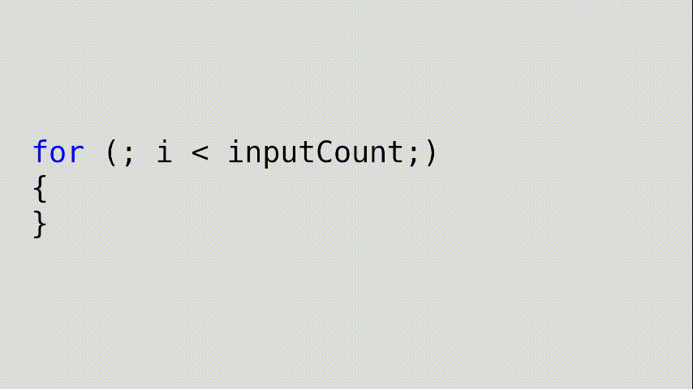

# Code Anmiator
A tool for creating video clips of text with animated decorations. *Define the text as text while declaring animations on a timeline.*

Designed to be used in the Unity Editor, using the Recoder package to output video files, and the Timeline package to configure teh animation.

Supports parsing HTML and using classes/ID's to poll element for spans to apply effects to.

## Features

Text Effects:
- Color
- Transparency
- Size (W/H, with/without scaling characters)

Decoration:
- Underline
- Box Outline
- Highlight

## How
Create a font. This package used sprites to render all characters, and the Font (ScriptableObject) turns a texture (font atlas) into the font characters. 

Create a FontAtlas for each style (normal, bold, italic), then Font asset. Add the FontAtlas assets to the Font asset. 

> See [Font Atlas Generator](https://lucide.github.io/Font-Atlas-Generator/).

In the scene, create a TextRenderer with the desired text. HTML supported, or use the included highlight package for code.

In the timeline, the span of text is determined by the track. There are two types of tracks.

- Text Track - effects that apply to the individual characters, like scale or color.
- Decoration Track - effects that add new rendered elements, like highlight or outline.

Select the track itself to edit the "Span Selector", a search for the text elements to effect.

Add various clips to effect the span on each timeline. Each clip is a single state, use the easing in/out or crossfades to effect them (this is why each track is a single span, so the 'mixing' between clips is coherent.)

---
With the Unity Recorder package, one can add a Recorder Track to precisely render the output. It can run lower than the target FPS and still output a clean video. *Because of this goal, I spent very little attention on efficient rendering.*